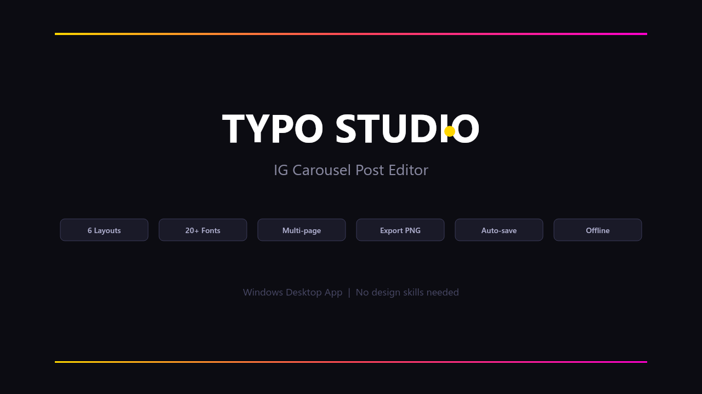

# TYPO STUDIO

> 中文友善的 Instagram 輪播貼文排版工具 — 桌面版 (Windows / Electron)

TYPO STUDIO 是一個離線、免帳號、所見即所得的 IG 貼文產生器。專為中文內容創作者設計：一套**自動排版引擎**幫你處理字級、斷行、避頭尾與對比度，讓你專注在文字本身，匯出即是 1080px 的高解析 PNG / JPG。



---

## ✨ 功能特色

### 自動排版引擎（v2 全新）
- **自動字級填滿**：標題依內容長度自動縮放，永不溢出、也不會留下大片空白。
- **中文避頭尾（kinsoku）**：標點符號（。，、！？」』等）不會出現在行首；開引號（「『（等）不會留在行尾。
- **平衡換行（text-wrap: balance）**：多行標題自動均衡每行寬度，不再「上長下短」。
- **英文 / 數字不斷詞**：`Canva`、`2026`、`ChatGPT` 等不會被從中間拆開。
- **一鍵自動修正排版**：工具列 `✨ 排版` 一鍵修正當前頁；`✨全部` 修正整份輪播（正規化空白、自動字級、對比度）。
- **即時對比度檢查**：WCAG 對比值即時顯示，過低時一鍵套用最佳文字色。

### 多頁輪播編輯
- 8 種頁型：**封面、圖上文下、文上圖下、左圖右文、左文右圖、條列/步驟、金句、結尾 CTA**。
- 頁面**新增 / 複製 / 刪除 / 重新排序**（← → 或拖動縮圖切換）。
- 內建大量封面 / 內文 / 金句 / CTA 模板與配色組合。

### 設計控制
- 22 種 Google Fonts（中文 / 襯線 / 無襯線 / 特殊），即時預覽。
- 強調色、文字色、背景（純色 + 漸層）、7 種封面裝飾（線條 / 圓點 / 方框 / 外框 / 四角 / 格線 / 斜角）。
- `{hl}文字{/hl}` 語法做局部高亮。
- 三種比例：1:1 (1080×1080)、4:5 (1080×1350)、9:16 (1080×1920)。

### 匯出與專案
- 匯出單頁或**全部頁面**，支援 **PNG / JPG**。
- 複製到剪貼簿（PNG）。
- **專案匯入 / 匯出 JSON**，跨裝置續編。
- 自動儲存（localStorage）、復原 / 重做（Ctrl+Z / Ctrl+Y）。

### 快捷鍵
| 快捷鍵 | 功能 |
| --- | --- |
| `Ctrl/⌘ + Z` | 復原 |
| `Ctrl/⌘ + Y` / `Ctrl+Shift+Z` | 重做 |
| `Ctrl/⌘ + D` | 複製當前頁 |
| `← / →` | 切換上一頁 / 下一頁 |

---

## 🚀 安裝使用

### 下載安裝檔（一般使用者）
到 [Releases](https://github.com/Hao0321/typo-studio/releases) 下載 `TYPO STUDIO Setup x.y.z.exe`，雙擊安裝即可。

### 從原始碼執行（開發者）
```bash
npm install
npm start          # 啟動桌面版（Electron）
```

### 打包安裝檔
```bash
npm run dist       # 編譯 JSX → 產生 NSIS 安裝檔到 dist/
npm run pack       # 只打包未壓縮資料夾（除錯用）
```
> `npm run dist` 會先執行 `npm run compile`（babel 把 `vendor/app.jsx` 編譯為 `vendor/app.compiled.js`），再由 `electron-builder` 打包。

---

## 🛠 技術架構

```
main.js              Electron 主程序（建立視窗）
preload.js           contextIsolation 安全橋接
index.html           入口；載入 React + 編譯後 App
vendor/
  app.jsx            ← 唯一的應用程式原始碼（React，全域 React、無 import）
  app.compiled.js    ← babel 編譯輸出（index.html 實際載入）
  react.min.js       React 18 UMD
  react-dom.min.js   ReactDOM 18 UMD
build-icon.js        產生 App 圖示
assets/              圖示與封面
```

- **無打包器**：刻意維持零 bundler。`vendor/app.jsx` 用 `@babel/preset-react` 編成一個檔，由 `index.html` 直接載入，方便閱讀與 hack。
- **單檔應用**：所有 UI、預覽渲染與 Canvas 匯出邏輯都在 `vendor/app.jsx`，預覽（DOM）與匯出（Canvas）共用同一套排版引擎以維持一致性。

### 修改原始碼的流程
1. 編輯 `vendor/app.jsx`
2. `npm run compile`（或 `npm run dist` 連同打包）
3. `npm start` 預覽

> ⚠️ 不要手改 `vendor/app.compiled.js`，它是編譯產物、會被覆蓋。

---

## 📝 字型說明（離線）
字型透過 Google Fonts CDN 載入，**首次需連網**以取得自訂字型；離線時會回退為系統預設字體，版面仍可正常運作與匯出。

---

## 🤝 貢獻
歡迎 issue 與 PR。請只修改 `vendor/app.jsx` 並附上 `npm run compile` 後的結果，或在 PR 說明中註明已編譯。

## 📄 授權
[MIT](LICENSE) © 2026 hao0321_studio
